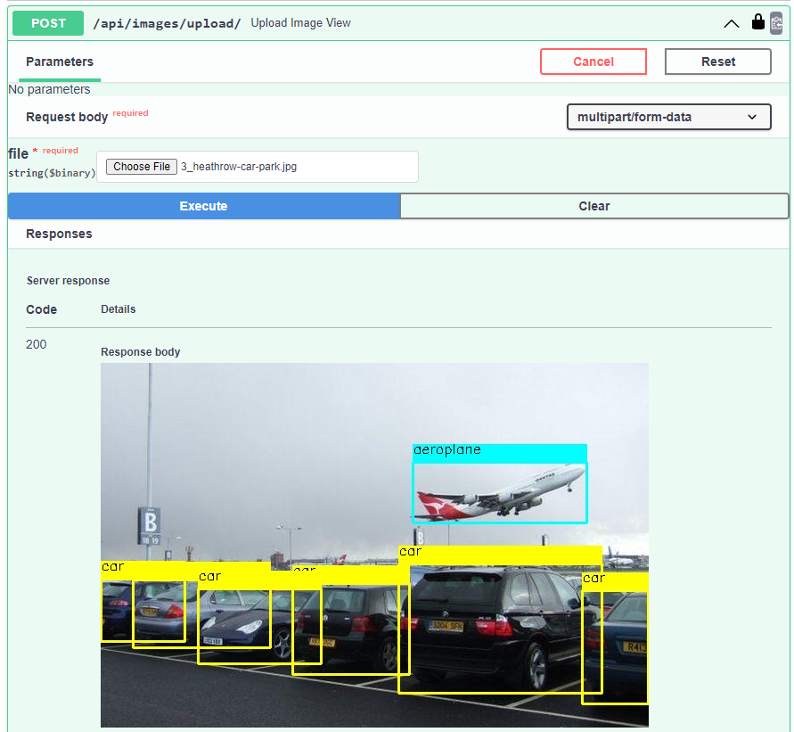

# FastAPI Project

An experimental project for FastAPI
**What does this application do?**
Currently the application provides:
- Managing users operations (create/list/delete)
- Using Postgres database to store the data
- User login and generating tokens.
- Securing certain endpoints, and making them available for authorized users only


**What does this application don't cover?**
- There are no tests cover any of the applied endpoints.

**How to run the application?**
1. Clone the repo
   ```bash
   git clone https://github.com/Al-Moatasem/fast-api-project.git
   ```
2. Rename `example.env` file into `.env`.
3. Update the configurations in `.env` to match your environment.
4. Make sure your machine can run `docker-compose` commands, [check this installation guide](https://docs.docker.com/compose/install/).
5. The `docker-compose.yaml` file has two services, the first one is based on a Dockerfile, so we need to build the image first, and the second service is the Postgres database, the file will pull an image from Docker Hub
   ```bash
   # build the application image
   docker-compose build

   # running the full application (FastAPI and the database)
   docker-compose up
   ```
   - In case of getting this message: `api_app  | exec ./entrypoint.sh: no such file or directory`, that mean the `entrypoint.sh` file is using `CRLF` for the end of line `EOL`, we need to set it to `LF`, in case of using VSCode, open the `entrypoint.sh` file, and on the status bar bottom-right section, change `CRLF` to `LF`
6. Once the two services are running, we can check the application by visiting `127.0.0.1:8000`, we should get something like this screenshot.
   
   Upload an image / detect objects
   
7. Using the endpoints
   1. We can use the application through the [generated docs](http://127.0.0.1:8000/docs), or
   2. Through code, [check this Jupiter Notebook](./notebooks/calling_api_endpoints.ipynb)
   
