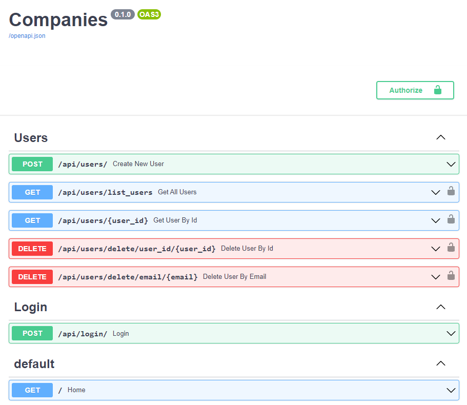

# FastAPI Project

An experimental project for FastAPI
**What does this application do?**
Currently the application provides:
- Managing users operations (create/list/delete)
- Using Postgres database to store the data
- User login and generating tokens.
- Securing certain endpoints, and making them available for authorized users only

**What does this application don't cover?**
- No database migration
  - will be implemented using Alembic
- There are no tests cover any of the applied endpoints.

